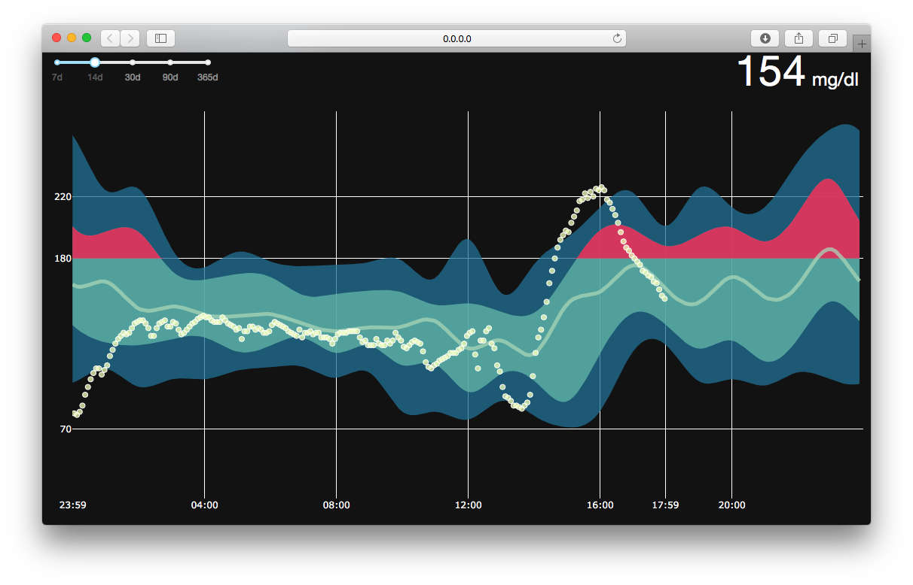
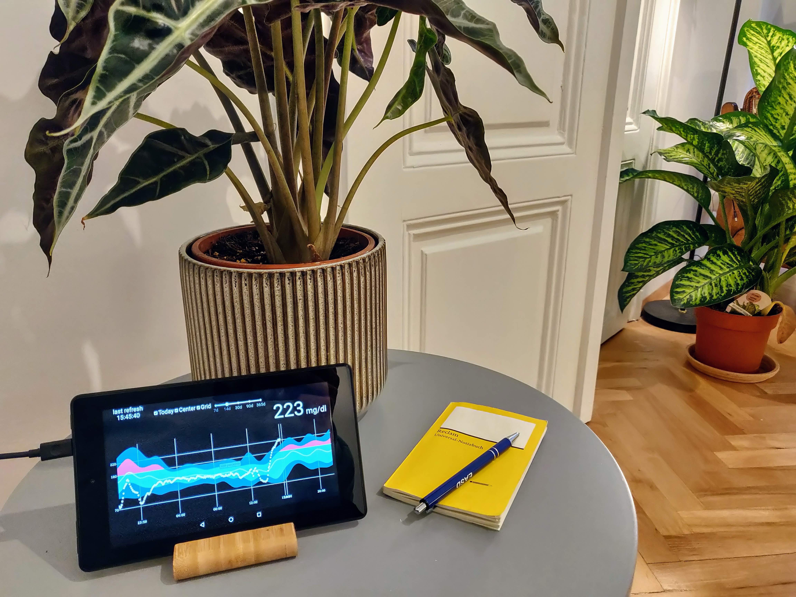

# cgm-dashboard

Plotly Dash based dashboard overlaying your CGM data on your CGM percentile plot. Designed to work with nightscout data and supports mongodb and REST. 

## what
>Who wants to check his/her CGM report? **Nobody!**

Still, many CGM users benefit from looking at their report, especially the Ambulatory Glucose Profile helps to quickly see at which time of the day your therapy needs attention.

cgm-dashboard was developed to make seeing your data **simple and fun**. Instead of limiting yourself to today's data or the AGP in your report, it *combines* them both. It brings your glucose data into perspective. On top of that, you can quickly take a glance on how you perform without downloading the report from your device manufacturer or opening an app. 

cgm-dashboard overlays your today's cgm data with your historic percentile plot. This allows you to quickly foresee if you enter a problematic time of the day. You can think of it as using the percentile plot as a forecast, based on your history.

## how to use it
The webbased dashboard can be accessed from any browser making it the perfect candidate for a left-over tablet. Just put it where you see it, anywhere in your home. 

## how it works
CGM Dashboard is a python based webserver that you can reach from any webbrowser. It uses plotly's dash to create a beautiful, minimalistic, java scrip based dasboard. You can run it from any machine such as your computer, or a raspbery pi as simple as calling

`python app.py`

And opening the dashboard from your browser
> http://0.0.0.0:8080
This will work when you access the website from the same machine running the code. If you want to access it from a different machine in your network, simply replace 0.0.0.0 with the ip address of the computer running it. Also, the port 8080 might be different. Check the log when running `python app.py` which will output the address. 

### app.py
Contains all plotly dash code. It configures the graphs and connects it to the data source.
### cgm.py
Provides access to the stored cgm data and performs pre-processing for visual representation.
### database.py
Handles the data storage and access. Uses adapter class to request more data from remote service.
### database.py
Handles the data access from remote services. For now, mongo database access and REST calls are supported.
### config.ini
Here, you need to fill in your backend credentials.

## installation
1. Checkout the git repository 
`git clone git@github.com:janvv/cgm-dashboard.git`

2. Downlaod the required python3 packages
`sudo pip install -r requirements.txt`

3. Fill in your nightscout credentials ...

	>**[REST]**  
	>domain = \<the domain of your REST service>  
	>port = \<the port of your REST service>
	
	or ...
	
   >**[MongoDB]**  
	>user = \<your mongo db user name>  
	>password = \<your mongo db password>  
	>host = \<your mongo db domain i.e. testuser.mlab.com>  
	>database = \<the name of the mongo database>  
	>port = \<the port of the mongo database>  
	
## Start upon boot
If you want the service to run in background all the time (i.e. on a raspberry pi), you can create a cronjob that starts the webserver upon boot.

First create a shell script to run the serbvice in background mode and save it as cgm-dash.sh

>\#Q/bin/sh  
>\#cgm-dash.sh  
>cd ~/git/cgm-dashboard  
>python ./app.py

Then, create a cronjob to execute the shell script on boot.

1. Open cronjob file  
> crontab -e

2. Add following line  
>@reboot sh \<path to shell script> \<path to logfile> 2>&1  

Note: 2>&1 directs error logs into the log file.  
I put the tool on my raspberry pi and it looked like this. The ./venv/bin/python is because I used a virtual environment to install only the packages that I really needed.

**cgm-dash.sh**
>\#Q/bin/sh  
>\#cgm-dash.sh  
>cd ~/git/cgm-dashboard  
>./venv/bin/python ./app.py  

And the line in the cronjob file 
>@reboot sh /home/pi/cron/cgm-dash.sh > /home/pi/cron/cgm-dash-logs 2>&1

## Trouble shooting (raspberry pi)
On raspberry pi, running the tool might result in a numpy error. Something with libatlas. For me it worked to reinstall numpy and install libatlas-base-dev again
`sudo apt-get install libatlas-base-dev` 

